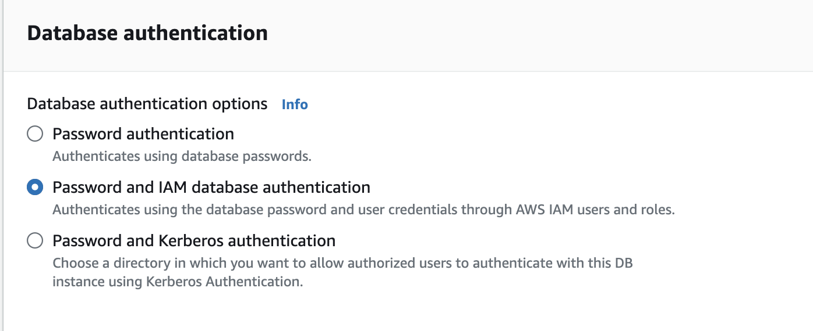

# Restrict access to the  PostgreSQL databases only to the services that need it
Amazon RDS does support IAM authentication, which allows you to use IAM roles to control access to your RDS databases. By leveraging IAM roles and Kubernetes service accounts, you can ensure that only specific pods within your Kubernetes cluster can access the RDS database. Here’s a detailed approach to setting this up:

## Step 1: Enable IAM DB Authentication for RDS

1. Modify the RDS Instance to Enable IAM Authentication:

- Go to the RDS console.
- Select your RDS instance.
- Modify the instance to enable IAM DB authentication.



[`Detailed Steps`](https://docs.aws.amazon.com/AmazonRDS/latest/UserGuide/UsingWithRDS.IAMDBAuth.Enabling.html) 

## Step 2: Create an IAM Policy for RDS Access

Create an IAM policy that allows the necessary access to your RDS instance.

1. Create a Policy:
```shell
{
  "Version": "2012-10-17",
  "Statement": [
    {
      "Effect": "Allow",
      "Action": [
        "rds-db:connect"
      ],
      "Resource": [
        "arn:aws:rds-db:<region>:<account-id>:dbuser:<DbiResourceId>/<db-user-name>"
      ]
    }
  ]
}
```
- `Effect` – Specify `Allow` to grant access to the DB instance. If you don't explicitly allow access, then access is denied by default.

- `Action` – Specify `rds-db:connect` to allow connections to the DB instance.

- `Resource` – Specify an Amazon Resource Name (ARN) that describes one database account in one DB instance. 

In this format, replace the following:

- `region` is the AWS Region for the DB instance.

- `account-id` is the AWS account number for the DB instance. 

To perform cross-account access, create an IAM role with the policy shown above in the account for the DB instance and allow your other account to assume the role.

- `DbiResourceId` is the identifier for the DB instance. This identifier is unique to an AWS Region and never changes.

To find a DB instance resource ID in the AWS Management Console for Amazon RDS, choose the DB instance to see its details. Then choose the Configuration tab. The Resource ID is shown in the Configuration section.

- `db-user-name` is the name of the database account to associate with IAM authentication. In the example policy, the database account is 

[`Detailed Steps`](https://docs.aws.amazon.com/AmazonRDS/latest/UserGuide/UsingWithRDS.IAMDBAuth.IAMPolicy.html) 

## Step 3: Create an IAM Role for RDS Access

Create an IAM role and attach the policy you created in Step 2 to this role.

1. Create the IAM Role:
- Go to the IAM console.
- Create a new role with the type "AWS Service" and choose "EC2" as the trusted entity.
- Attach the policy created in Step 2 to this role.

##  Step 4: Annotate the Kubernetes Service Account with the IAM Role

Associate the IAM role with a Kubernetes service account using IAM Roles for Service Accounts (IRSA).

1. Create the Kubernetes Service Account:
```shell
apiVersion: v1
kind: ServiceAccount
metadata:
  name: rds-access-sa
  namespace: your-namespace
  annotations:
    eks.amazonaws.com/role-arn: arn:aws:iam::<your-account-id>:role/<your-role-name>
```

Use the Service Account in Your Pods

##  Step 5: Using IAM authentication with PostgreSQL

To use IAM authentication with PostgreSQL, connect to the DB instance as the master user or a different user who can create users and grant privileges. After connecting, create database users and then grant them the rds_iam role as shown in the following example.

```shell
CREATE USER <db_username>; 
GRANT rds_iam TO <db_username>;
```


## Step 6: Update Application to Use IAM Authentication Token
Modify your application to generate an IAM authentication token and use it to connect to the RDS instance.
Generate IAM Authentication Token:

Use AWS SDKs or CLI to generate the token.

